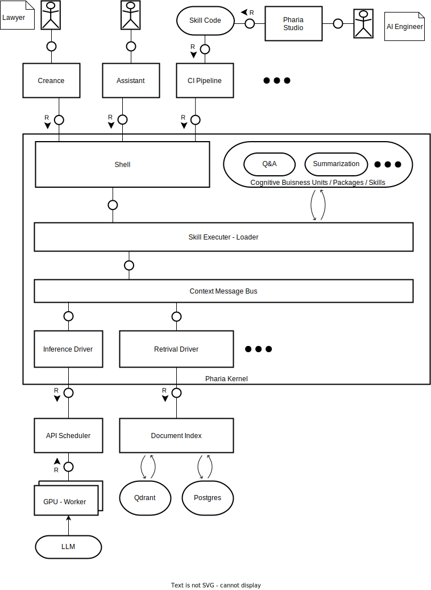
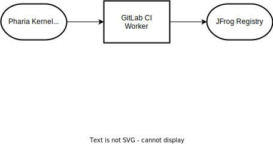

# Pharia Kernel

Pharia Kernel allows you to execute Cognitive Buisness Units written in Python and handles their interaction with other modules of Pharia like inference and search.

## Contributing

In this repository we stick to Conventional commits. See: <https://www.conventionalcommits.org/en/v1.0.0/>.

## Deployment

Releases will be deployed to JFrog docker registry.

