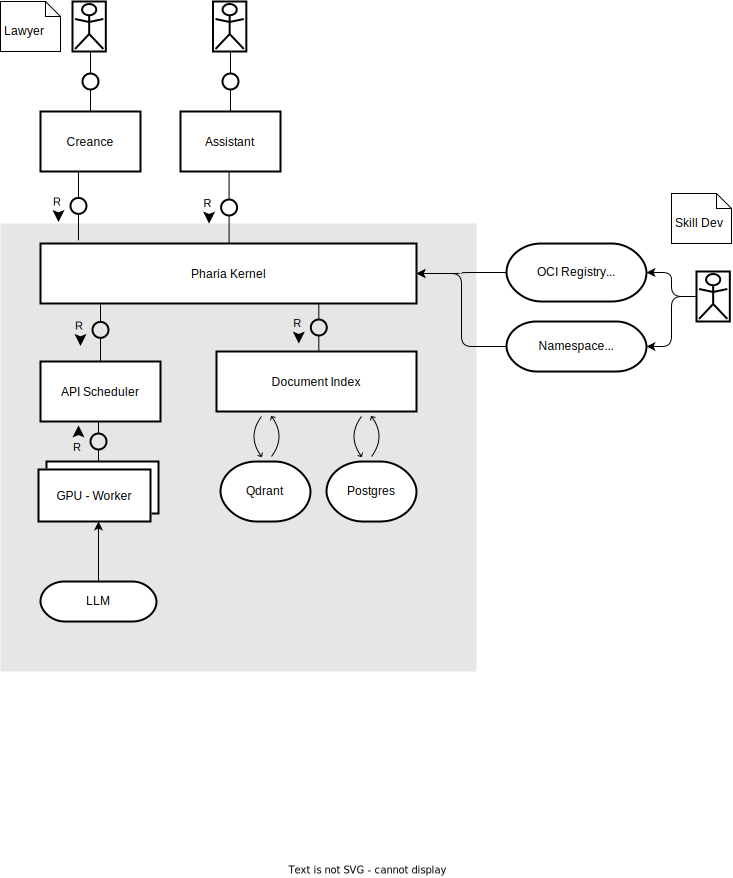
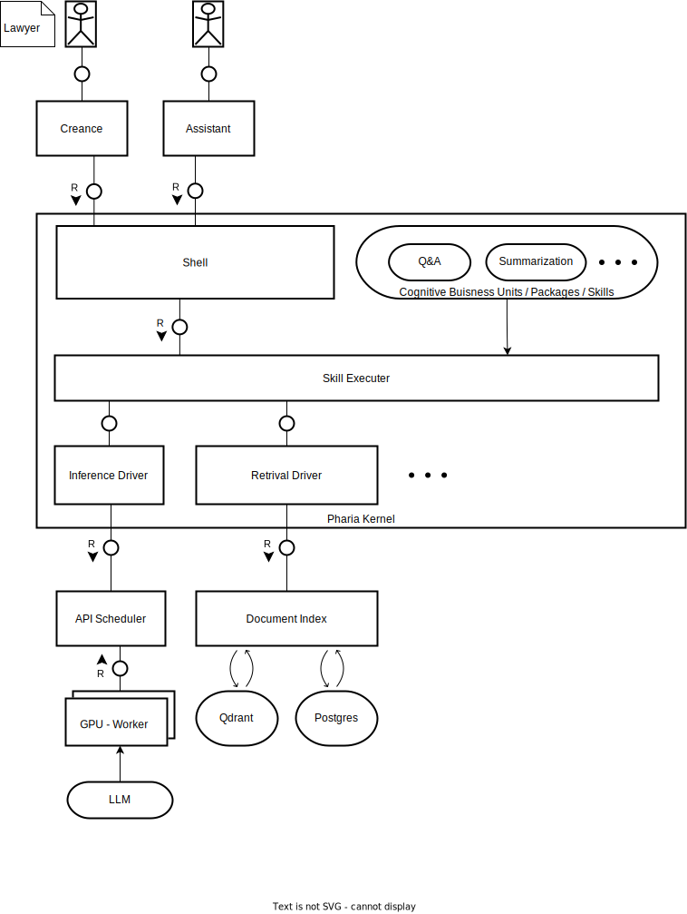
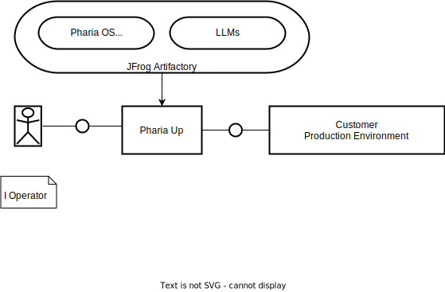

# Pharia Kernel

Pharia Kernel allows you to execute Cognitive Business Units called skills. These Skill can be written in a number of languages, including Python. The kernel handles the interaction between these skills and drivers for functionality like inference and retrival via the cognitive system interface. This enables to deploy RAG usecases serverless.

The entire Stack including Kernel, Inference, Document Index, etc is called **Pharia OS**.

The current prototype is deployed at <https://pharia-kernel.aleph-alpha.stackit.run>

The status page for uptime robot is found at: <https://stats.uptimerobot.com/gjXpoIPMnv>



## Contributing

In this repository we stick to Conventional commits. See: <https://www.conventionalcommits.org/en/v1.0.0/>.

### Local Development setup

There are some prerequisites you need to install once

```shell
# We need the Wasm target to be able to compile the skills
rustup target add wasm32-wasi
# The wasm-tools are also required for our skill build tooling
cargo install wasm-tools
```

Every time we change the example skill we need to rebuild them.

```shell
./build-skill.sh
```

### Building and running the kernel container using Podman

Now, you can build the image with

```shell
podman build . --tag pharia-kernel
```

Then, run the image with

```shell
podman run -v ./operator-config.toml:/app/operator-config.toml -p 8081:8081 --env-file .env pharia-kernel
```

We configure the bind address and port via the environemnt variable `PHARIA_KERNEL_ADDRESS`.
If not configured it defaults to "0.0.0.0:8081", which is necessary in the container, but locally may cause the firewall to complain.

#### MacOS

Podman on MacOS requires a separate virtual machine run by the user. To compile Pharia Kernel, at least 4 GiB of RAM are needed and 8 GiB are recommended. You set this up with

```shell
podman machine init
podman machine set --memory 8192
podman machine start
```

When building the image, you need to specify the target platform.

```shell
podman build . --tag pharia-kernel --platform linux/arm64
```

### curl commands

health check:

```shell
curl -v GET 127.0.0.1:8081/healthcheck
```

list skills:

```shell
curl -v GET 127.0.0.1:8081/skills
curl -v GET 127.0.0.1:8081/cached_skills
j
```

execute skill:

```shell
curl -v -X POST 127.0.0.1:8081/execute_skill \
-H 'Authorization: Bearer AA_API_TOKEN' \
-H 'Content-Type: application/json' \
-d '{"skill":"pharia-kernel-team/greet_skill", "input":"Homer"}'
```

## User manual

The user manual is a static site generated by [mdBook](https://rust-lang.github.io/mdBook/index.html), a simple site generator that supports Markdown, TOC, Linkcheck, PlantUml, etc.

The user manual will be served by the Pharia Kernel app at `docs/` path (eg. `http://localhost:8081/docs/`).

For local development you can run the site generator locally, either via docker or via the mdBook tool chain.

### Run via podman

***Note:*** *the following steps assume that you are in the workspace's root directory.*

As a prerequisite you have to build the container image once:

```shell
podman build -f Containerfile.mdbook -t mdbook .
```

On MacOS we need to add the target platform

```shell
podman build -f Containerfile.mdbook -t mdbook --platform linux/arm64
```

Run the container with mounted sources:

```shell
podman run -ti --mount type=bind,source="$(pwd)",target=/mdbook --network host --name mdbook mdbook
```

and run mdbook in the interactive container shell, e.g:

```shell
mdbook serve doc
```

(open <http://localhost:3000>, and see the site updating when you save modified pages sources)

### Run via mdBook tool chain

***Note:*** *the following steps assume that you have [Rust](https://www.rust-lang.org/tools/install) installed and that you are in the workspace's root directory.*

Install mdbook:

```shell
cargo install mdbook
```

Install mdbook plugins:

```shell
cargo install mdbook-pagetoc
cargo install mdbook-plantuml
cargo install mdbook-linkcheck
```

Install PlantUml:

Arch Linux: `pacman -S plantuml`

MacOs: `brew install plantuml`

Manually: see [plantUML installation](https://plantuml.com/starting)

PlantUml requires `graphviz` and needs to be executable via `plantuml` command. You can run a health-check with `plantuml -version`

## pushing skill oci

login to container registry:

```shell
podman login registry.gitlab.aleph-alpha.de
```

push container:

```shell
wasm-to-oci push skills/greet-py.wasm registry.gitlab.aleph-alpha.de/engineering/pharia-skills/skills/greet-py:v1
```

pull container:

```shell
wasm-to-oci pull registry.gitlab.aleph-alpha.de/engineering/pharia-skills/skills/greet-py:v1 --out skills/oci.wasm
```

## Design Pharia Kernel

Pharia Kernel is a single process running in a docker container, running actors in a tokio runtime.



* **Shell**: Exposes interface for applications. Handles http requests.
* **Skill Executer**: Invokes skill in green threads. Forwards their input and output to the shell. Exposes the **C**ognitive **System** **I**nterface (CSI) to the skills.
* **Context Message Bus**: Exposes the combined API of all drivers via channel to the **Skill Executer** and handles messaging between drivers.
* **Drivers**: Act as ports for the various external systems.

## Deploying Pharia Kernel on Customer side

**Pharia Kernel** is intended to be installed **on premise** by the customer it. It is deployed, as are all other modules of the **Pharia OS**, to the JFrog Artifactory. Our colleagues at the Pharia OS Team are going to develop tooling for deploying tooling for rolling it out. Until they come up with a name it is here called "Pharia Up".


