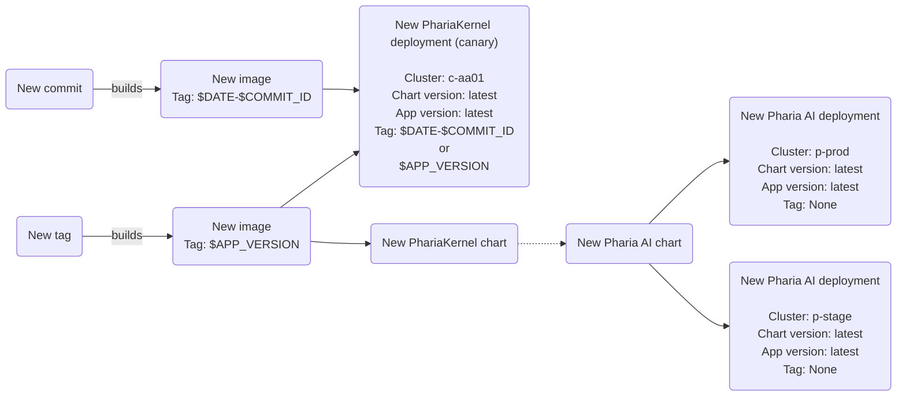

# Release

This flow chart illustrates how PhariaKernel is published and deployed.

```mermaid
flowchart LR
    A(New commit) -->|builds| B("New image<br/>Tag: $DATE-$COMMIT_ID")
    B --> C("New PhariaKernel deployment (canary)<br/><br/>Cluster: c-aa01<br/>Chart version: latest<br/>App version: latest<br/>Tag: $DATE-$COMMIT_ID<br/>or<br/>$APP_VERSION")
    D(New tag) -->|builds| E("New image<br/>Tag: $APP_VERSION")
    E --> C
    E --> F(New PhariaKernel chart)
    F .-> G(New Pharia AI chart)
    G --> H("New Pharia AI deployment<br/><br/>Cluster: p-prod<br/>Chart version: latest<br/>App version: latest<br/>Tag: None")
    G --> I("New Pharia AI deployment<br/><br/>Cluster: p-stage<br/>Chart version: latest<br/>App version: latest<br/>Tag: None")

```
