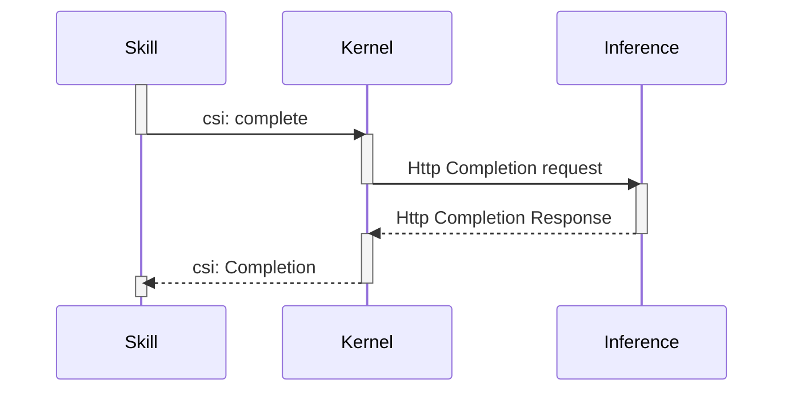

```mermaid
sequenceDiagram
    participant Skill
    participant Kernel
    participant Inference

    activate Skill
    Skill->>Kernel: csi: complete
    deactivate Skill
    activate Kernel

    Kernel->>Inference: Http Completion request
    deactivate Kernel
    activate Inference
    Inference-->>Kernel: Http Completion Response
    deactivate Inference
    activate Kernel

    Kernel-->>Skill: csi: Completion
    activate Skill
    deactivate Kernel
    deactivate Skill
```